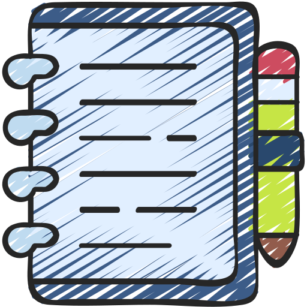

<!-- markdownlint-disable MD033 MD041 -->

# Polyglot Notebook Docfx Plugin

[:running: **_Getting Started_**](https://bmazzarol.github.io/Polyglot.Notebook.Docfx.Plugin/articles/getting-started.html)
|
[:books: **_Documentation_**](https://bmazzarol.github.io/Polyglot.Notebook.Docfx.Plugin)

Docfx plugin for Polyglot Notebooks :notebook:

## Why?

Docfx is a great tool for creating documentation, but it lacks support for
Polyglot Notebooks. This plugin aims to fill that gap by providing a way to
render Polyglot Notebooks in Docfx.

## Attributions

[Icons created by juicy_fish](https://www.flaticon.com/free-icons/construction)
